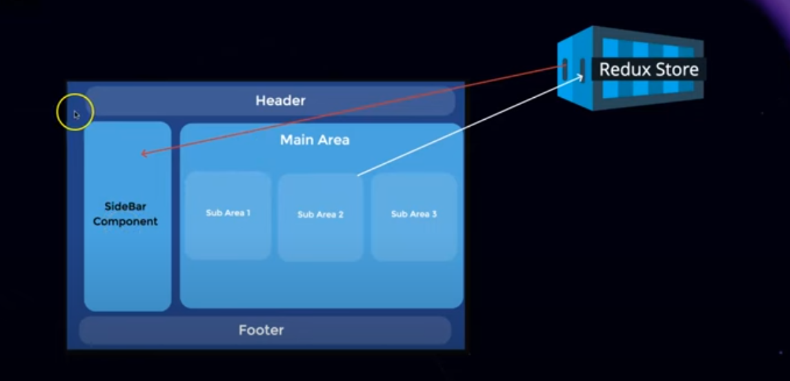
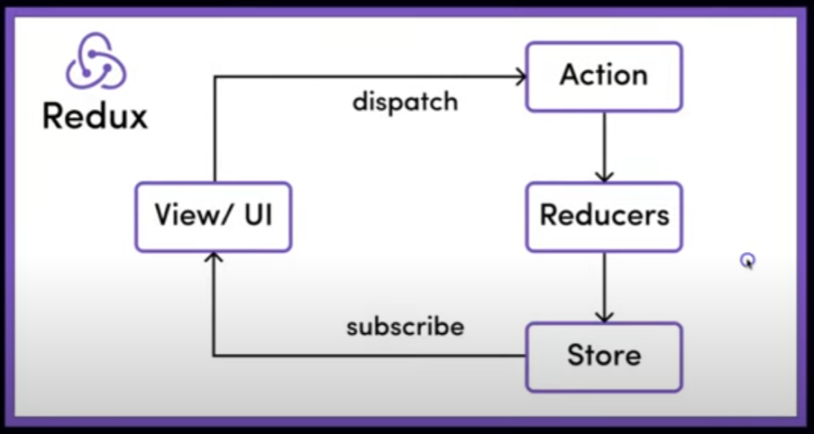
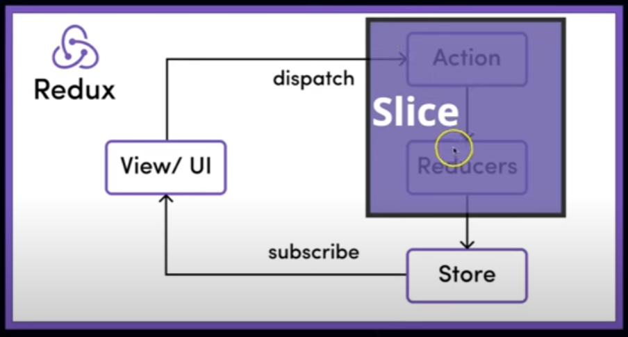

Normally , if we want to send data from sub area to sidebar components. Using normal React/Nextjs can use usestate or context api.
If we use UseState , in it , we can send data from subarea to mainarea and main area to root. from root we can send anywhere.
It it lengthy so can use Context api , in it we can directly send it to destination.It can handle small data easily but cause problem in big data or api calls.

So Redux / Redu Toolkit handle this problem.
Here it store data in reduxstore so it can send at any place where it needed.


These are main components of redux . 
* View/UI - The actual project that we see.
* Dispatch - Send Data
* Action - It the part of data which we want to add in Redux store
* Reducers - It used to add data in In Redux Store
* Store - Redux Store where we store Data.
* Subscribe  - If component A  stored data in Redux Store then Any other component can get data from it called Subscribe.


In Redux Toolkit refer above img

###Question - 
If we refresh website is data save in redux store ?
-> No , redux do not store date in local storage , it store in objects format so if we refresh data then it get vanished. If we want to store in locally then we can use Redux Persist library but makes app slow.

## Installation

```
npm install @reduxjs/toolkit react-redux
```

## Folder
Make folder having any folder name. We can make folder in anywhere in code , but it is better to make it in app folder.

make 3 files naming - 
provider.js
slice.js
store.js

### store.js

we need to import configureStore so type "configureStore" it will automatically import it.

```
const { configureStore } = require("@reduxjs/toolkit");

export const store = configureStore({
    reducer:{}
})

```

provider.js

```
"use client"

import { store } from "./store";

const { Provider } = require("react-redux");

export function Providers({children}){
    return <Providers store={store}>
    {children}
    </Providers>
}
```

layout.js
```
import { Inter } from "next/font/google";
import "./globals.css";
import { Providers } from "./redux/providers";

const inter = Inter({ subsets: ["latin"] });

export const metadata = {
  title: "Create Next App",
  description: "Generated by create next app",
};

export default function RootLayout({ children }) {
  return (
    <html lang="en">
      <body className={inter.className}>
        <Providers>{children}</Providers>
      </body>
    </html>
  );
}

```